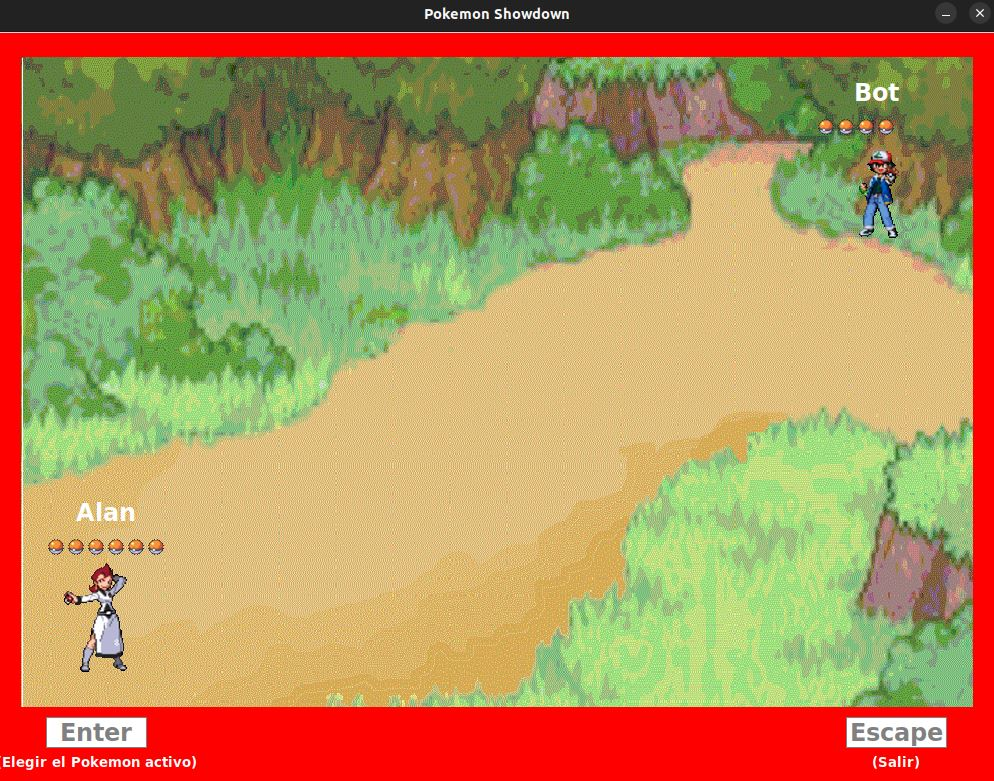
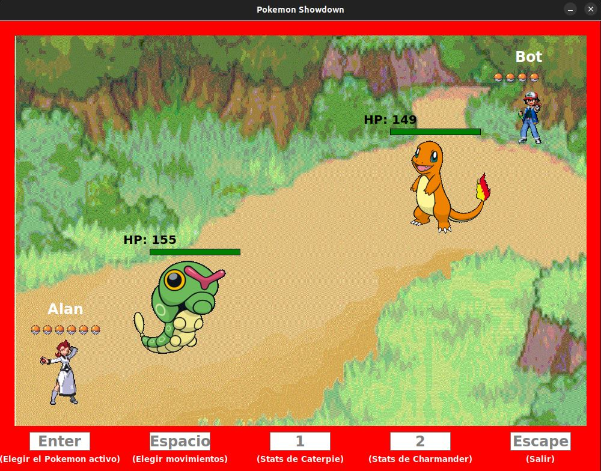
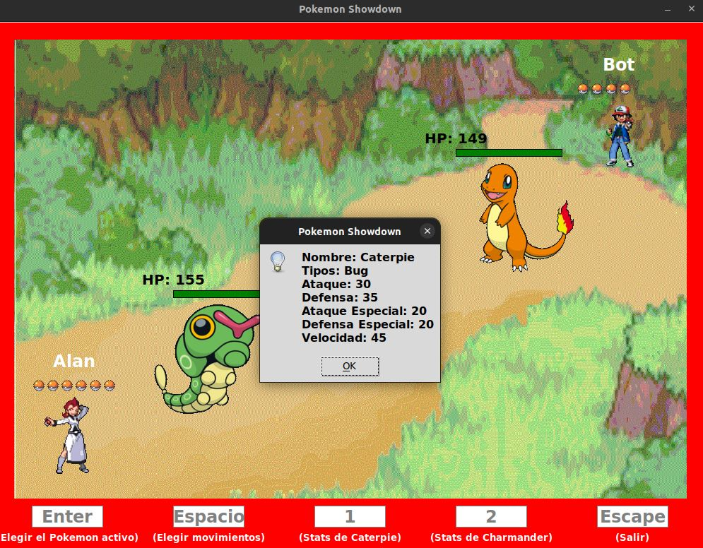
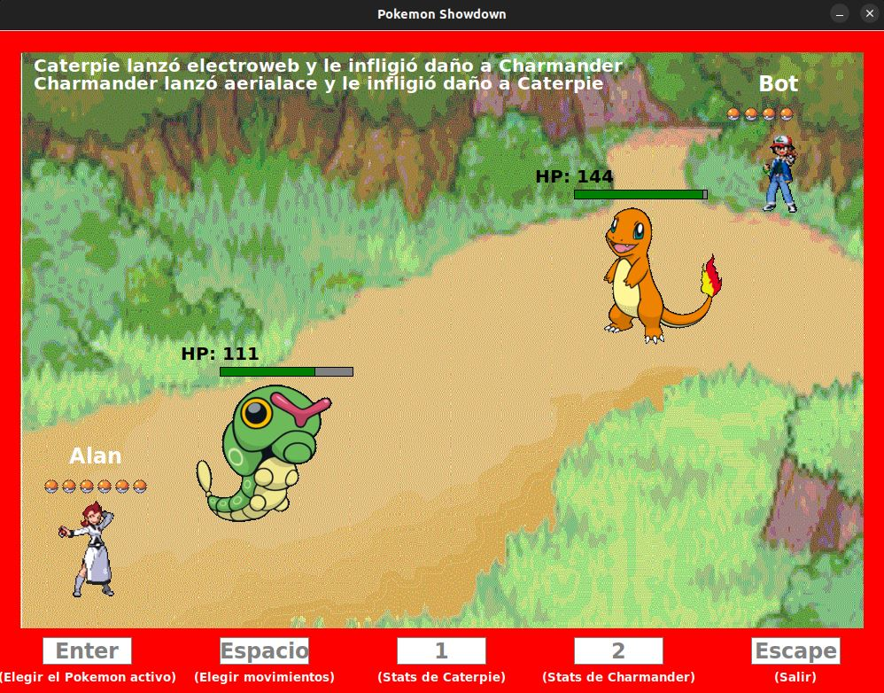

# Pokemon Showdown

Algoritmos y Programación I - [1C 2021]

Trabajo final

## Grupo

* **Integrante 1** - [Alan Valdevenito](https://github.com/AlanValdevenito)
* **Integrante 2** - [Mateo Julián Rico](https://github.com/ricomateo)

## Equipos

Se deberan armar los equipos previo a jugar dentro del archivo "partida.csv" con el siguiente formato:
- Nombre del equipo;Nombre del pokemon;Ataque uno, Ataque dos, Ataque tres

Actualmente existen dos equipos con los nombres "Uno" y "Dos" para poder iniciar una partida.

## Ejecucion

Ejecutar en una terminal:

```
$ python3 main.py
```

Inicialmente se debera ingresar el nombre para el jugador 1 y el nombre del equipo. Se debera repetir lo mismo para el jugador 2. Al hacer esto se abrira la siguiente ventana:



Cuando inicie el juego, se debe presionar ENTER para ingresar el nombre del Pokemon que se desea activo para ambos equipos. Este debe encontrarse en el archivo "partida.csv". Luego de que se hayan elegido los pokemons para cada equipo, se iniciara la batalla:



Tendremos la opcion de cambiar de Pokemon en cualquier momento y tambien de ver sus stats:



Presionando la tecla ESPACIO se podra elegir el ataque para ambos pokemons activos. Para elegir el movimiento se debera ingresar "S" o "N" segun vayan apareciendo los nombres de cada ataque. Ademas, arriba a la izquierda se mostrara un mensaje que indicara el ataque realizado por cada pokemon:


